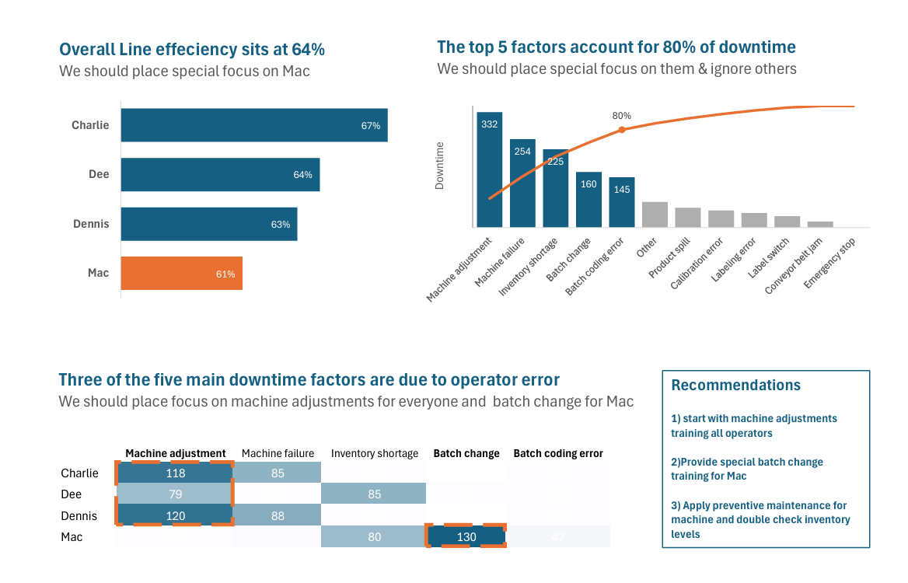

### Abc

### Jump to a section:

- 3 STATEMENT MODEL
- DCF
- LBO
- US Employment Dashboard
- Coffee shop sales Dashboard

---

### 🔹 [US Employment Dashboard](https://github.com/RashwanthJeyaprakash/Employment_Dashboard)

An interactive Excel dashboard exploring U.S. job market trends by state and sector.

- Focus: Excel (formulas, slicers, tables — **no PivotTables**, visualization, exploratory)  

Preview:  

---

### 🔹Manufacturing Productivity Analysis 

This Excel-based project Report analyzes the productivity of a manufacturing line using downtime data across different operators and failure types.

-Focus: Excel (Formulas, calculated fields, Visualization)

### 🔹 [Coffee_Shop_Dashboard](https://github.com/RashwanthJeyaprakash/CoffeeShop_dashboard)

A basic sales dashboard that would help stakeholders understand key performance drivers across product, location & time.

- Focus: Excel (Pivot table & charts, dashboards placements & layout, visualization )

Preview:

  

---

## 🛢 DCF / LBO / 3 STATEMENT Models

*Coming soon...*

---

> ⚡ This portfolio is actively evolving as I continue building skills across different tools and datasets. 
